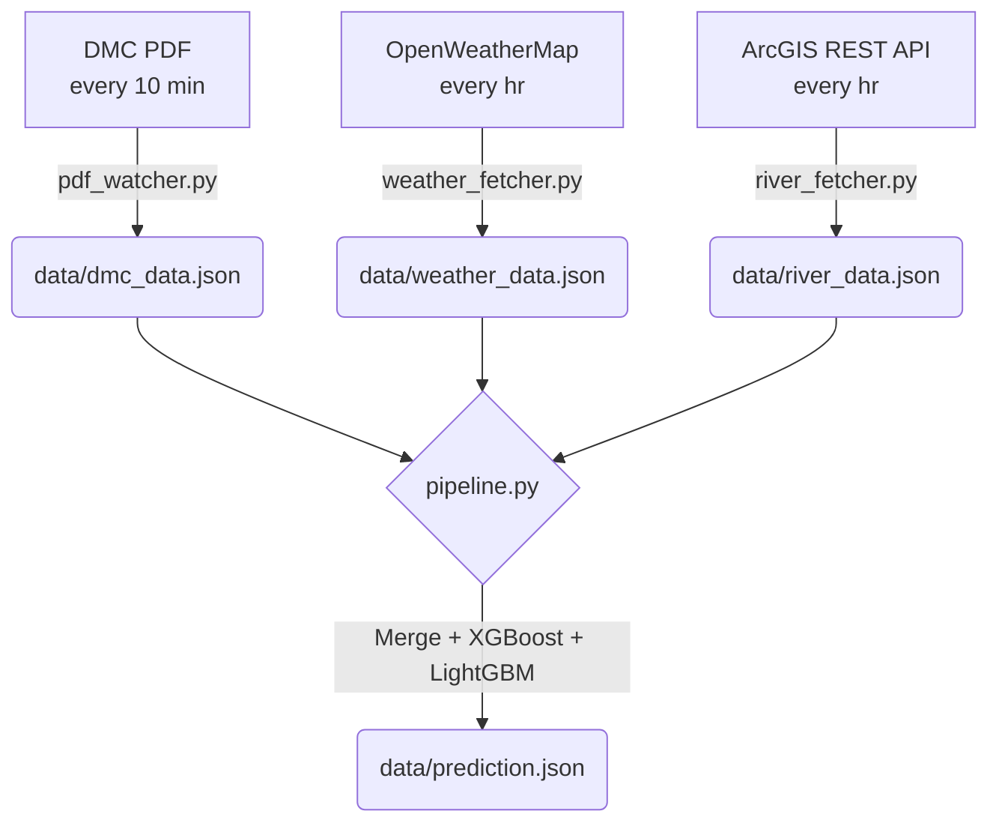

# RTFD Model — Real-Time Flood Detection Pipeline

> Automated disaster prediction pipeline for the **Gin Ganga (Gin River)** basin — Baddegama & Thawalama stations. Fully automated via GitHub Actions.


## 📖 Table of Contents
- [Overview](#overview)
- [Architecture](#architecture)
- [Monitored Stations](#monitored-stations)
- [Pipeline Execution](#pipeline-execution)
- [Machine Learning Models](#machine-learning-models)
- [Failure Handling & Resilience](#failure-handling--resilience)
- [Troubleshooting Reference](#troubleshooting-reference)

## 📌 Overview
RTFD (Real-Time Flood Detection) is an automated machine learning pipeline predicting flood conditions for the Gin Ganga basin in Sri Lanka. It ingests data continuously from Disaster Management Centre PDFs, OpenWeatherMap API, and ArcGIS REST API, utilizing an ensemble approach of XGBoost and LightGBM models for real-time predictions. 

## 🏗 Architecture
The data ingestion and model inference pipeline operates continuously, orchestrated via scheduled GitHub Actions workflows.



## 📍 Monitored Stations

| Station ID | Station Name | Latitude | Longitude | River     | Focus            |
| ---------- | ------------ | -------- | --------- | --------- | ---------------- |
| `BAD01`    | Baddegama    | 6.17     | 80.18     | Gin Ganga | All Sources      |
| `THA01`    | Thawalama    | 6.34     | 80.33     | Gin Ganga | All Sources      |
| `DEN01`    | Deniyaya     | 6.35     | 80.56     | Gin Ganga | OWM Only         |
| `LAN01`    | Lankagama    | 6.37     | 80.47     | Gin Ganga | OWM Only         |
| `MAK01`    | Makurugoda   | 6.18     | 80.17     | Gin Ganga | OWM Only         |
| `UDU01`    | Udugama      | 6.23     | 80.32     | Gin Ganga | OWM Only         |

*(OWM fetches target all 6 locations; DMC and ArcGIS services natively focus on Baddegama & Thawalama)*

## ⚙️ Pipeline Execution

### GitHub Actions Environment
Workflows run automatically on defined cron schedules.
Required Repository Secret: `OPENWEATHER_API_KEY`

### Local Execution
To manually run the pipeline components:
```bash
# Requires OPENWEATHER_API_KEY environment variable
python weather_fetcher.py
python river_fetcher.py
python pdf_watcher.py

# Run model inference and data merge
python pipeline.py
```

## 🧠 Machine Learning Models

Model artifacts are stored in the `models/` directory:
- `models/xgboost_model.pkl`
- `models/lightgbm_model.pkl`

**Fallback Mechanism:** If the model binaries are missing or fail to load, `pipeline.py` defaults to a resilient rule-based threshold predictor.

### Feature Vectors
Prediction relies on the following model inputs:

| Feature | Source | Description |
|---|---|---|
| `dmc_current_wl` | DMC PDF | Current Water Level |
| `dmc_previous_wl` | DMC PDF | Previous Water Level |
| `dmc_rainfall_mm` | DMC PDF | Rainfall |
| `dmc_rising` | DMC PDF | Target Status (1: Rising, 0: Falling) |
| `owm_rainfall_1h` | OWM | Weather Map Rainfall (1 hour) |
| `owm_humidity` | OWM | Humidity Percentage |
| `owm_clouds_pct` | OWM | Cloud Covering Percentage |
| `arc_water_level_m` | ArcGIS | Live Feature Server Water Level |
| `arc_rainfall_mm_hr` | ArcGIS | Live Feature Server Rainfall Measurement |

## 🛡️ Failure Handling & Resilience

The pipeline is built to handle intermittent source downtime gracefully.

| Scenario | System Behavior |
| --- | --- |
| **DMC site unreachable** | Logs warning; bypasses update and utilizes existing `dmc_data.json`. |
| **Same PDF seen twice** | Silently skipped (validated via `last_seen_pdf.txt`). |
| **PDF parse yields 0 records** | Aborts overwrite; retains existing JSON data. |
| **OWM fetch fails (1 station)** | Logs warning; omits the specific failing station. |
| **All OWM fetches fail** | Logs error; retains `weather_data.json`. |
| **ArcGIS returns 0 features** | Logs warning; initializes an empty-stations JSON object. |
| **Source JSON missing** | Re-loads the last committed file version; pipeline execution continues. |
| **ML Models not found** | Executes safety rule-based threshold fallback logic. |

## 🛠️ Troubleshooting Reference

### ArcGIS Fetch Failures
`river_fetcher.py` directly targets the feature service supporting the Gin River Dashboard. If the internal queries shift and return empty features:
1. Verify the exact query in browser Developer Tools (Network tab -> "FeatureServer").
2. Update the `ARCGIS_SERVICE_URL` string in `river_fetcher.py` with the updated query parameters.
